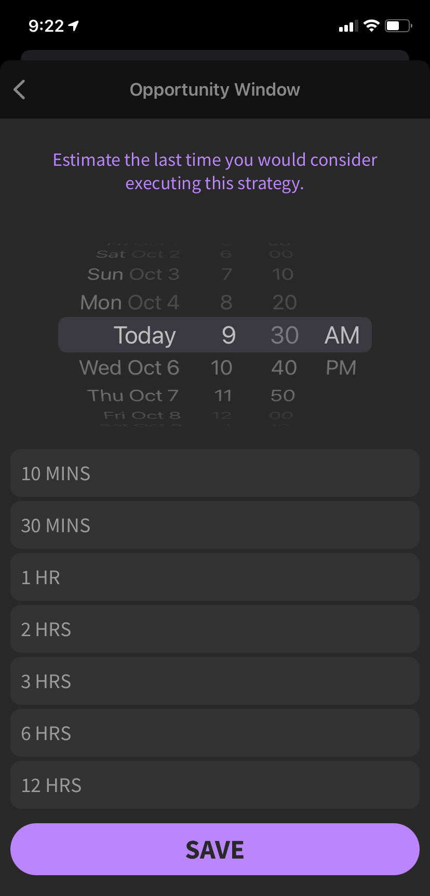

# Gandalf iOS - Share Stock Trading Strategies

The Gandalf iOS app allows users to create complex stock trading strategies, and the time windows in which those strategies might be useful. Users can then vote on strategies to get feedback prior to execution.

## Views

### Strategy View

The main view shows a list of strategies based on a combination of creation time, expiration time, and votes.

<!--  -->

### Strategy Creation

Create a new strategy.

Select the ticker symbol.

Select the window of opportunity expiration.

### Strategy Detail

